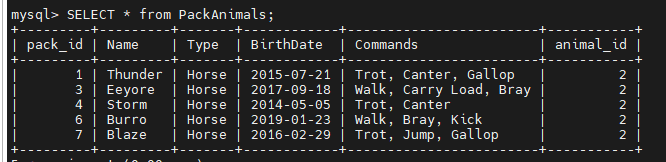

### Работа с MySQL

Задача выполняется в случае успешного выполнения задачи "Работа с MySQL в Linux. Установить MySQL на вашу машину".

Я использую MobaXTerm на рабочем ПК (нет возможности установки софта). VM с Ubuntu и MySQL настроена на планшете (скрины с Ubuntu в предыдущих заданиях с планшета).
![MobaXTerm] (pictures/MySQL1.png)

7. В подключенном MySQL репозитории создать базу данных "Друзья человека":
```sql
CREATE DATABASE friends_of_human;
```

** Создать таблицы с иерархией из диаграммы в БД:**

USE friends_of_human;
```sql
-- Таблица Animals
```sql
CREATE TABLE Animals (
    animal_id INT AUTO_INCREMENT PRIMARY KEY,
    class_name VARCHAR(50)
);

-- Вставка данных в таблицу Animals
INSERT INTO Animals (class_name) VALUES ('Pets');
INSERT INTO Animals (class_name) VALUES ('Pack animals');

-- Таблица для класса "Pets"
```sql
CREATE TABLE Pets (
    pet_id INT AUTO_INCREMENT PRIMARY KEY,
    Name VARCHAR(50),
    Type VARCHAR(50),
    BirthDate DATE,
    Commands VARCHAR(255)
);

-- Таблица для класса "Pack animals"
```sql
CREATE TABLE PackAnimals (
    pack_id INT AUTO_INCREMENT PRIMARY KEY,
    Name VARCHAR(50),
    Type VARCHAR(50),
    BirthDate DATE,
    Commands VARCHAR(255)
);

![таблицы] (pictures/MySQL2.png)
```

-- Вставляем данные в таблицу "Pets"
```sql
INSERT INTO Pets (Name, Type, BirthDate, Commands) VALUES
    ('Fido', 'Dog', '2020-01-01', 'Sit, Stay, Fetch'),
    ('Whiskers', 'Cat', '2019-05-15', 'Sit, Pounce'),
    ('Hammy', 'Hamster', '2021-03-10', 'Roll, Hide'),
    ('Buddy', 'Dog', '2018-12-10', 'Sit, Paw, Bark'),
    ('Smudge', 'Cat', '2020-02-20', 'Sit, Pounce, Scratch'),
    ('Peanut', 'Hamster', '2021-08-01', 'Roll, Spin'),
    ('Bella', 'Dog', '2019-11-11', 'Sit, Stay, Roll'),
    ('Oliver', 'Cat', '2020-06-30', 'Meow, Scratch, Jump');

-- Вставляем данные в таблицу "PackAnimals"
```sql
INSERT INTO PackAnimals (Name, Type, BirthDate, Commands) VALUES
    ('Thunder', 'Horse', '2015-07-21', 'Trot, Canter, Gallop'),
    ('Sandy', 'Camel', '2016-11-03', 'Walk, Carry Load'),
    ('Eeyore', 'Donkey', '2017-09-18', 'Walk, Carry Load, Bray'),
    ('Storm', 'Horse', '2014-05-05', 'Trot, Canter'),
    ('Dune', 'Camel', '2018-12-12', 'Walk, Sit'),
    ('Burro', 'Donkey', '2019-01-23', 'Walk, Bray, Kick'),
    ('Blaze', 'Horse', '2016-02-29', 'Trot, Jump, Gallop'),
    ('Sahara', 'Camel', '2015-08-14', 'Walk, Run');

![таблицы] (pictures/MySQL3.png)

-- Добавляем столбцы `animal_id` в таблицы `Pets` и `PackAnimals` в качестве внешних ключей:
```sql
ALTER TABLE Pets
ADD COLUMN animal_id INT,
ADD CONSTRAINT fk_pets_animals FOREIGN KEY (animal_id) REFERENCES Animals(animal_id);

ALTER TABLE PackAnimals
ADD COLUMN animal_id INT,
ADD CONSTRAINT fk_pack_animals_animals FOREIGN KEY (animal_id) REFERENCES Animals(animal_id);

-- Обновляем `animal_id` для таблиц `Pets` и `PackAnimals`:
```sql
UPDATE Pets
SET animal_id =
    CASE
        WHEN Type = 'Dog' OR Type = 'Cat' OR Type = 'Hamster' THEN 1
        ELSE NULL
    END;

UPDATE PackAnimals
SET animal_id =
    CASE
        WHEN Type = 'Horse' OR Type = 'Camel' OR Type = 'Donkey' THEN 2
        ELSE NULL
    END;

![таблицы] (pictures/MySQL4.png)

-- Удаление записей о верблюдах из таблицы "Pack animals"
```sql
UPDATE PackAnimals SET Type = 'Horse' WHERE Type = 'Donkey';
![Удаление записи] (pictures/MySQL5.png)


-- для объединения заменяем значение типа животного с "Donkey" на "Horse".
-- Таким образом, записи о лошадях и осях будут объединены в одну группу.
```sql
UPDATE PackAnimals SET Type = 'Horse' WHERE Type = 'Donkey';




-- Создание новой таблицы для животных в возрасте от 1 до 4 лет
```sql
CREATE TABLE AnimalsAge1to4 (
    animal_id INT PRIMARY KEY,
    Name VARCHAR(50),
    Type VARCHAR(50),
    BirthDate DATE
);

-- Добавление записей из таблицы "Pets"
```sql
INSERT INTO AnimalsAge1to4 (animal_id, Name, Type, BirthDate)
SELECT pet_id, Name, Type, BirthDate
FROM Pets
WHERE TIMESTAMPDIFF(YEAR, BirthDate, CURDATE()) BETWEEN 1 AND 3;

-- Добавление записей из таблицы "Pack animals"
```sql
INSERT INTO AnimalsAge1to4 (animal_id, Name, Type, BirthDate)
SELECT pack_id, Name, Type, BirthDate
FROM PackAnimals
WHERE TIMESTAMPDIFF(YEAR, BirthDate, CURDATE()) BETWEEN 1 AND 3;

-- Вычисление возраста с точностью до месяца
```sql
SELECT *,
    CONCAT(
        TIMESTAMPDIFF(YEAR, BirthDate, CURDATE()), ' years ',
        TIMESTAMPDIFF(
            MONTH,
            DATE_ADD(BirthDate, INTERVAL TIMESTAMPDIFF(YEAR, BirthDate, CURDATE()) YEAR),
            CURDATE()
        ), ' months'
    ) AS Age
FROM AllAnimals;

+-----------+--------+---------+------------+-------------------+
| animal_id | Name   | Type    | BirthDate  | Age               |
+-----------+--------+---------+------------+-------------------+
|         3 | Hammy  | Hamster | 2021-03-10 | 2 years 10 months |
|         5 | Smudge | Cat     | 2020-02-20 | 3 years 11 months |
|         6 | Peanut | Hamster | 2021-08-01 | 2 years 6 months  |
|         8 | Oliver | Cat     | 2020-06-30 | 3 years 7 months  |
+-----------+--------+---------+------------+-------------------+

-- Создание общей таблицы с указанием принадлежности к исходным таблицам
```sql
CREATE TABLE AllAnimals (
    source_table VARCHAR(50), -- Столбец для указания источника данных
    animal_id INT,
    Name VARCHAR(50),
    Type VARCHAR(50),
    BirthDate DATE,
    Age VARCHAR(50), -- Добавление столбца для возраста
    Commands VARCHAR(255) -- Добавление столбца для команд (для PackAnimals)
);

-- Вставка данных из таблицы "Pets"
```sql
INSERT INTO AllAnimals (source_table, animal_id, Name, Type, BirthDate, Age, Commands)
SELECT 'Pets', pet_id, Name, Type, BirthDate,
    CONCAT(
        TIMESTAMPDIFF(YEAR, BirthDate, CURDATE()), ' years ',
        TIMESTAMPDIFF(MONTH, DATE_ADD(BirthDate, INTERVAL TIMESTAMPDIFF(YEAR, BirthDate, CURDATE()) YEAR), CURDATE()), ' months'
    ) AS Age,
    Commands
FROM Pets;

-- Вставка данных из таблицы "Pack animals"
```sql
INSERT INTO AllAnimals (source_table, animal_id, Name, Type, BirthDate, Age, Commands)
SELECT 'Pack animals', pack_id, Name, Type, BirthDate,
    CONCAT(
        TIMESTAMPDIFF(YEAR, BirthDate, CURDATE()), ' years ',
        TIMESTAMPDIFF(MONTH, DATE_ADD(BirthDate, INTERVAL TIMESTAMPDIFF(YEAR, BirthDate, CURDATE()) YEAR), CURDATE()), ' months'
    ) AS Age,
    Commands
FROM PackAnimals;

