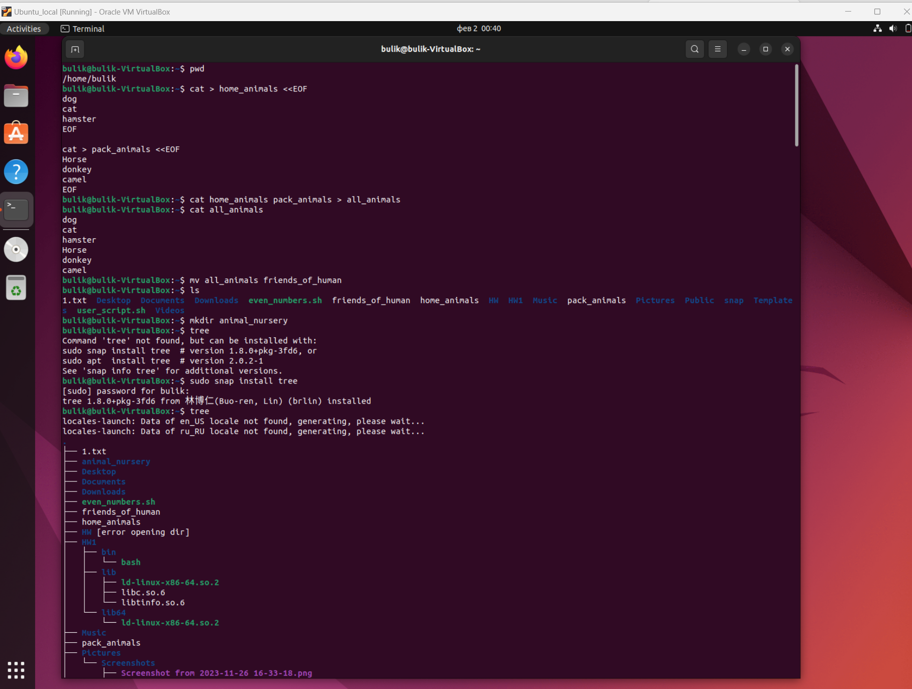
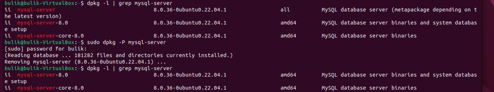
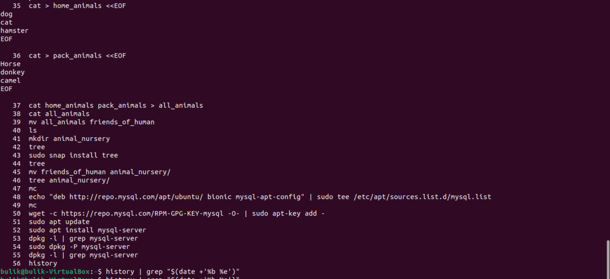

# Задачи:

1. **Использование команды cat в терминале Linux:**
    - Создать два файла:
        - "Домашние животные" (содержит собак, кошек и хомяков)
        - "Вьючные животные" (содержит лошадей, верблюдов и ослов)
    - Объединить созданные файлы.
    - Просмотреть содержимое объединенного файла.
    - Переименовать файл в "Друзья человека".

```bash
bulik@bulik-VirtualBox:~$ cat > home_animals <<EOF
dog
cat
hamster
EOF

cat > pack_animals <<EOF
Horse
donkey
camel
EOF
bulik@bulik-VirtualBox:~$ cat home_animals pack_animals > all_animals
bulik@bulik-VirtualBox:~$ cat all_animals
dog
cat
hamster
Horse
donkey
camel
bulik@bulik-VirtualBox:~$ mv all_animals friends_of_human




2. **Создание директории и перемещение файла:**
    - Создать директорию.
    - Переместить файл в созданную директорию.

```bash
bulik@bulik-VirtualBox:~$ mkdir animal_nursery
bulik@bulik-VirtualBox:~$ mv friends_of_human animal_nursery/
bulik@bulik-VirtualBox:~$ tree animal_nursery/
animal_nursery/
└── friends_of_human

0 directories, 1 file

3. **Подключение дополнительного репозитория MySQL и установка пакета:**
    - Подключить дополнительный репозиторий MySQL.
    - Установить любой пакет из этого репозитория.

```bash
bulik@bulik-VirtualBox:~$ echo "deb http://repo.mysql.com/apt/ubuntu/ bionic mysql-apt-config" | sudo tee /etc/apt/sources.list.d/mysql.list
[sudo] password for bulik: 
deb http://repo.mysql.com/apt/ubuntu/ bionic mysql-apt-config
bulik@bulik-VirtualBox:~$ wget -c https://repo.mysql.com/RPM-GPG-KEY-mysql -O- | sudo apt-key add -
--2024-02-02 00:05:05--  https://repo.mysql.com/RPM-GPG-KEY-mysql
bulik@bulik-VirtualBox:~$ sudo apt update
bulik@bulik-VirtualBox:~$ sudo apt install mysql-server


4. **Установка и удаление deb-пакета с помощью dpkg:**
    - Установить deb-пакет.
    - Удалить deb-пакет с помощью dpkg.
//Установили mysql-server в предыдущем задании

```bash
bulik@bulik-VirtualBox:~$ dpkg -l | grep mysql-server
ii  mysql-server                               8.0.36-0ubuntu0.22.04.1                 all          MySQL database server (metapackage depending on the latest version)
ii  mysql-server-8.0                           8.0.36-0ubuntu0.22.04.1                 amd64        MySQL database server binaries and system database setup
ii  mysql-server-core-8.0                      8.0.36-0ubuntu0.22.04.1                 amd64        MySQL database server binaries
bulik@bulik-VirtualBox:~$ sudo dpkg -P mysql-server
[sudo] password for bulik: 
(Reading database ... 181282 files and directories currently installed.)
Removing mysql-server (8.0.36-0ubuntu0.22.04.1) ...
bulik@bulik-VirtualBox:~$ dpkg -l | grep mysql-server
ii  mysql-server-8.0                           8.0.36-0ubuntu0.22.04.1                 amd64        MySQL database server binaries and system database setup
ii  mysql-server-core-8.0                      8.0.36-0ubuntu0.22.04.1                 amd64        MySQL database server binaries




5. **Выложение истории команд в терминале Ubuntu:**
    - Выложить историю команд в терминале Ubuntu.


```bash
bulik@bulik-VirtualBox:~$ history


 

